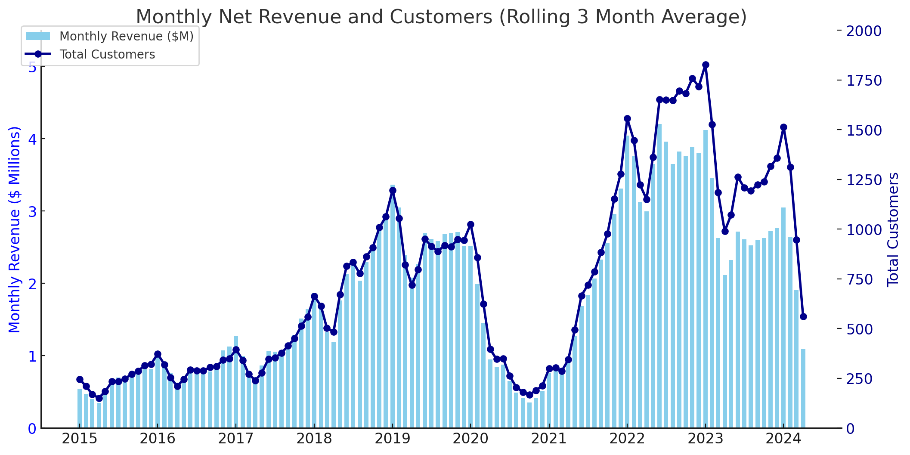
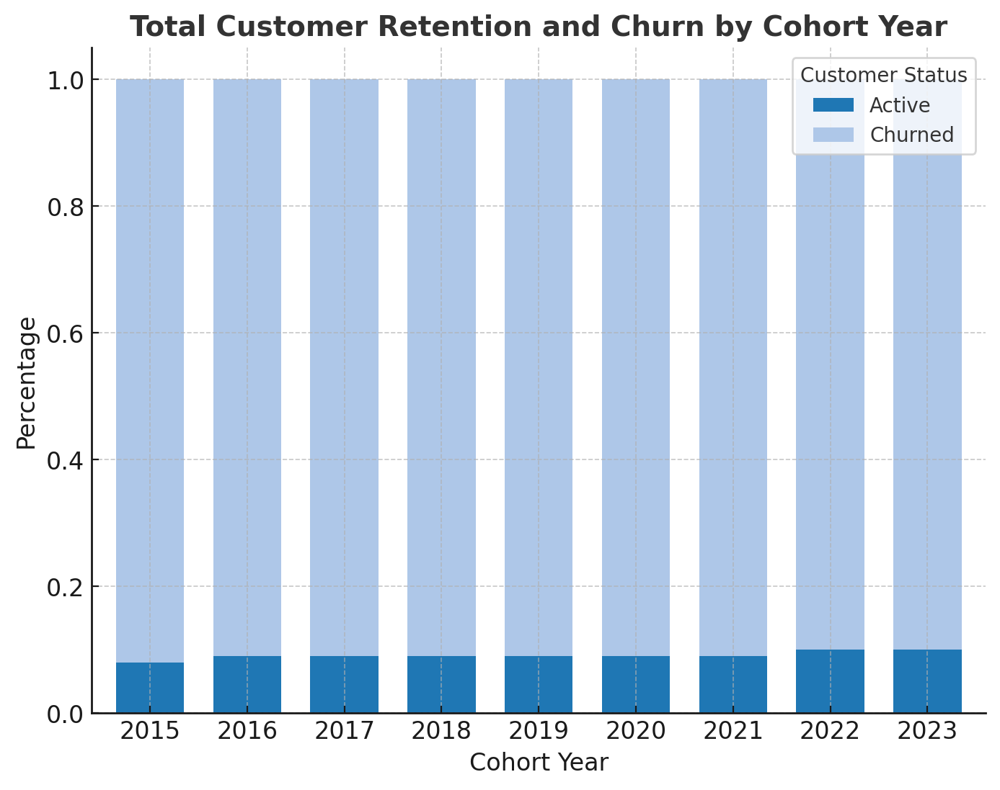

# Intermediate SQL - Sales Analysis

## Overview
Analysis of customer behavior, retention, and lifetime value for an e-commerce company to improve customer retention and maximize revenue.

## Business Questions
1. **Customer Segmentation:** Who are our most valuable customers?  
2. **Cohort Analysis:** How do different customer groups generate revenue?  
3. **Retention Analysis:** Which customers haven't purchased recently?  

---

## Clean Up Data

**🖥️ Query**: [0_create_view.sql](0_create_view.sql)

- Created a unified view combining transaction and customer-level details  
- Calculated first purchase dates to support cohort and retention analysis  
- Aggregated revenue data for accurate customer segmentation and tracking.

## Analysis

### 1. Customer Segmentation

**🖥️ Query**: [1_customer_segmentation.sql](1_customer_segmentation.sql)

- Grouped customers by total revenue to estimate lifetime value  
- Defined three tiers: High, Mid, and Low-value customers  
- Aggregated metrics such as average order value and number of orders per segment.  

**📈 Visualization:**

📊 **Key Findings:**
High-Value Customers (65.6%) contribute the majority of total revenue despite being a smaller portion of the overall customer base. They are critical for business profitability.

Mid-Value Customers (32.3%) represent a significant portion of revenue and can be nurtured to upgrade into high-value status through personalized promotions or loyalty programs.

Low-Value Customers (2.1%) bring in minimal revenue. While they are the least profitable, they still offer potential for growth with cost-effective re-engagement strategies.

💡 **Business Insights**
**High-Value:** Prioritize this group with exclusive benefits (VIP access, early sales, dedicated support) — small churns here lead to large losses.  
- **Mid-Value:** Focus on education and product discovery to increase engagement and transition them into the high-value segment.  
- **Low-Value:** Apply reactivation campaigns, discounts, and product bundles to incentivize repeat purchases.  

### 2. Customer Revenue by Cohort
**🖥️ Query**: [cohort_analysis.sql](cohort_analysis.sql)

- Grouped customers by their first purchase year  
- Calculated revenue and active customers per cohort  
- Normalized cohort revenue to compare long-term contribution trends 

**📈 Visualization:**

Investigate Monthly Revenue & Customer Trends (3 Month Rolling Average)

  

📊 **Key Findings:**  

- Customers who joined during 2016–2019 generated significantly higher revenue at the time of their first purchase. This suggests that earlier acquisition strategies were more effective in attracting high-value customers with stronger initial purchasing behavior.
- In contrast, cohorts from 2021 onwards show a noticeable decline in average first-time purchase revenue. While customer acquisition may have increased, the initial spending per customer has dropped, potentially due to weaker onboarding, economic factors, or changes in customer expectations.
- Although newer cohorts brought in a higher volume of customers, this did not translate into proportionally higher revenue. This indicates a need to not just attract more users, but ensure quality engagement and higher-value conversions from the start.

💡 **Business Insights:**

- Revisit and enhance onboarding and marketing strategies used during 2016–2019 to replicate success in newer cohorts.
- Improve early engagement campaigns and incentives for new users to increase their first-purchase value.
- Focus on attracting high-intent customers, not just increasing volume, to ensure long-term profitability and cohort performance.

### 3. Customer Retention
🖥️ Query: [3_retention_analysis.sql](3_retention_analysis.sql)

- Measured active customers over time since acquisition  
- Found a stable long-term retention plateau at ~8–10%  
- Identified that most churn happens within the first 6 months

**📈 Visualization:**

📊 **Key Findings:**  

- Across all cohort years, **churn rates are extremely high**, typically around **90–92%**, regardless of acquisition year.
- **Retention rates** (active customers) have remained **consistently low**, with only about **8–10%** of customers staying active.
- The **churn pattern has remained unchanged** year-over-year, indicating a **persistent and systemic retention issue**.

💡 **Business Insights:**
- The business is likely **losing customers after their initial few interactions**, pointing to potential gaps in:
  - Onboarding
  - Customer satisfaction
  - Follow-up strategies
- A **systemic approach** is required to address churn — **one-time campaigns are not sufficient**.
- Since this trend has **persisted for nearly a decade**, the company should **re-evaluate its customer experience strategy** and consider investing in:
  - **Strong first 90-day onboarding**
  - **Personalized follow-ups**
  - **Post-purchase incentives and product education**
- **Customer Lifetime Value (CLV)** improvements will largely depend on **reducing early-stage churn**, as that’s when most customers are dropping off.

## Strategic Recommendations

### 1. **Customer Value Optimization** (Customer Segmentation)
- Launch VIP program for 12,372 high-value customers (66% revenue)  
- Create personalized upgrade paths for mid-value segment ($66.6M → $135.4M opportunity)  
- Design price-sensitive promotions for low-value segment to increase purchase frequency  

### 2. **Cohort Performance Strategy** (Customer Revenue by Cohort)
- Target 2022–2024 cohorts with personalized re-engagement offers  
- Implement loyalty/subscription programs to stabilize revenue fluctuations  
- Apply successful strategies from high-spending 2016–2018 cohorts to newer customers  

### 3. **Retention & Churn Prevention** (Customer Retention)
- Strengthen first 1–2 year engagement with onboarding incentives and loyalty rewards  
- Focus on targeted win-back campaigns for high-value churned customers  
- Implement proactive intervention system for at-risk customers before they lapse  

---

## Technical Details

- **Database:** PostgreSQL  
- **Analysis Tools:** PostgreSQL, DBeaver  
- **Visualization:** ChatGPT, SQL-generated visual exports  